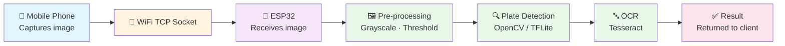

# Project Vision — License Plate Reader (ESP32)

**Version:** 1.0  
**Date:** 2026-02-27  
**Authors:** Andrea Venegas, Sergio Lara  

---

## 1. High-Level Project Overview

### 1.1 Business Problem

Identifying vehicles manually in parking lots, checkpoints, or access-control scenarios is slow, error-prone, and dependent on personnel being present. A low-cost automated system capable of reading license plates in real time reduces the overhead of manual verification and enables future integration with access-control databases without requiring expensive industrial hardware.

### 1.2 Problem Statement

| | |
|---|---|
| **The problem of** | Manually identifying vehicles by their license plate |
| **Affects** | Parking operators, security personnel, vehicle registry systems |
| **The impact is** | Slow throughput, human error, and high operational cost |
| **A successful solution would** | Automatically extract the plate text from a captured image with acceptable accuracy, using only low-cost embedded hardware and open-source software |

### 1.3 Project Position

The system is an academic prototype of an embedded license-plate-recognition (LPR) unit. It targets contexts where commercial solutions (IP cameras + dedicated servers) are too expensive and a lightweight, self-contained device is preferred. The ESP32's integrated WiFi and dual-core processor allow it to serve as the central node, receiving images from a mobile phone and returning recognized text — no paid cloud API is required.

### 1.4 Organizational Position

The project is developed within the Embedded Systems course (Octavo semester, Engineering program). The objective is for the team to apply the full embedded-systems development cycle — from requirements to a working demo — under Agile/Scrum methodology.

---

## 2. Stakeholders

| Stakeholder | Interest / Role |
|---|---|
| **Engineering students (team)** | Primary developers; responsible for design and implementation |
| **Course professor** | Evaluator and process-methodology guide |
| **Potential end users** | Parking lot operators and access-control administrators |

---

## 3. User Description

### 3.1 User Profiles

| User Type | Background | Expectations |
|---|---|---|
| **Lab evaluator / professor** | Expert in embedded systems; evaluates architecture, code quality, and documentation | Working demo, clear architecture, meeting requirements |
| **Operator (end user)** | Minimal technical knowledge | Point phone at plate → receive text immediately |
| **Developer (team)** | Intermediate C/C++, Python, Git | Reproducible build, documented codebase, clean firmware |

### 3.2 User Environment

- Development takes place in a university electronics lab and personal computers.
- The system is used indoors with controlled lighting for OCR reliability.
- The mobile phone and ESP32 must share a local WiFi network or the ESP32 acts as a soft-AP.
- The team uses VS Code + Arduino IDE for firmware, Python for any companion scripts, Git + GitHub for version control.

### 3.3 Current User Needs

| Problem | Current Workaround | Desired Outcome |
|---|---|---|
| Manual plate transcription is slow | Writing down plates by hand | Automatic text extraction in < 3 s |
| Commercial LPR hardware is expensive | Not used | Functional system under $20 USD BOM |
| No feedback on processing state | None | LED + serial/WiFi status message |

### 3.4 Alternative Solutions

| Alternative | Strengths | Weaknesses |
|---|---|---|
| **Cloud API (Google Vision / AWS Rekognition)** | High accuracy, fast, no embedded processing | Requires paid subscription, internet dependency |
| **Raspberry Pi + camera module** | More processing power, runs full OpenCV natively | Higher cost (~$60+), less appropriate as embedded MCU-level device |
| **Proposed: ESP32 + mobile phone** | Low cost, WiFi-native, portable, open-source stack | RAM constraints require careful model optimization |

---

## 4. Application Overview

### 4.1 Application Perspective

The system operates as a WiFi server running on the ESP32. The mobile phone client sends a JPEG image over a TCP socket; the ESP32 orchestrates preprocessing, plate detection through a TFLite model, and OCR via Tesseract (or a Python companion script on the phone/laptop for the MVP). The result string is returned to the client.

### 4.2 Summary of Application Capabilities

| Application Function | Key Benefit |
|---|---|
| WiFi image reception from mobile | Reuses existing hardware; no dedicated camera module needed |
| Local image pre-processing | Improves OCR accuracy without cloud dependency |
| Plate-region detection | Reduces OCR noise by focusing on relevant area |
| OCR character extraction | Converts image to actionable text |
| LED status indicator | Real-time feedback without serial monitor |
| Optional SQLite / Firebase logging | Enables persistence for historical lookups |

### 4.3 Assumptions and Dependencies

- Mexican standard license plate format is the primary target.
- OpenCV, Tesseract, and TFLite Micro are available under their respective open-source licenses.
- A Python 3.x companion script may run on a laptop for MVP to offload heavy OCR during early sprints.
- The Arduino ESP32 core and all required libraries are installable without paid licences.

---

## 5. Application Features

| ID | Feature | Priority |
|---|---|---|
| F-01 | WiFi AP mode: ESP32 hosts its own network for phone connection | High |
| F-02 | TCP image receiver: accept JPEG frames from client | High |
| F-03 | Image preprocessing pipeline (grayscale, threshold, denoise) | High |
| F-04 | Plate region detection (contour-based or TFLite model) | High |
| F-05 | OCR character extraction (Tesseract) | High |
| F-06 | Result transmission back to client over WiFi | High |
| F-07 | LED state machine (idle / processing / done / error) | Medium |
| F-08 | Serial debug log | Medium |
| F-09 | Optional: plate read history stored locally (SQLite / SPIFFS) | Low |

---

## 6. Additional Application Requirements

### 6.1 Constraints

- Total BOM cost ≤ $20 USD.
- All software tools must be free and open-source (Arduino IDE, VS Code, OpenCV, Tesseract, TFLite).
- Indoor use only; no weatherproofing required.
- ESP32 SRAM: 520 KB — image buffers and model must fit within this budget.

### 6.2 Quality Ranges

| Attribute | Target |
|---|---|
| OCR accuracy | ≥ 85 % on clear, well-lit plates |
| End-to-end latency | ≤ 3 s from image send to result display |
| Firmware stability | No crashes during a 10-minute continuous demo |
| Code coverage (unit tests) | Key processing functions covered by at least basic test cases |

### 6.3 Precedence and Priority

1. WiFi communication (F-01, F-02) — core infrastructure
2. Image processing pipeline (F-03, F-04, F-05) — core functionality
3. Result delivery and feedback (F-06, F-07) — user experience
4. Persistence / logging (F-09) — optional enhancement

### 6.4 Applicable Standards

- ESP32 Arduino Core coding conventions
- C++ naming and formatting consistent across firmware
- Git branching: `main` protected; features developed in `feature/` branches

### 6.5 System Requirements

| Layer | Requirement |
|---|---|
| MCU | ESP32 (Xtensa LX6, 240 MHz, 4 MB Flash, 520 KB SRAM) |
| IDE | Arduino IDE 2.x or VS Code + Arduino extension |
| Companion (optional) | Python 3.10+, OpenCV 4.x, Tesseract 5.x |
| Version control | Git + GitHub |
| Project management | GitHub Projects or Trello |

### 6.6 Performance Requirements

- Image transmission over WiFi: ≤ 500 ms for a 640×480 JPEG.
- Preprocessing pipeline: ≤ 800 ms on ESP32.
- OCR (on companion or ESP32): ≤ 1500 ms.
- Total pipeline ≤ 3 s end-to-end.

### 6.7 Documentation Requirements

- SRS (already in `docs/architecture/SRS/`)
- HLR / LLR (already in `docs/architecture/HLR/` and `LLR/`)
- This Project Vision document
- Sprint planning board (GitHub Projects)
- Inline code comments following Doxygen style

---

## 7. Product Backlog

> Sprint Planning recurrence: **1 week per sprint**

| ID | User Story | Priority | Story Points | Sprint |
|---|---|---|---|---|
| US-01 | As a developer, I want the ESP32 to broadcast a WiFi AP so the phone can connect without external router. | High | 3 | 1 |
| US-02 | As a developer, I want the ESP32 to receive a JPEG image over TCP so I can process it locally. | High | 5 | 1 |
| US-03 | As a developer, I want a grayscale + threshold preprocessing stage so OCR input quality improves. | High | 3 | 2 |
| US-04 | As a developer, I want contour-based plate region detection so only the plate area is sent to OCR. | High | 8 | 2 |
| US-05 | As a developer, I want Tesseract OCR integrated (via Python companion) so characters are extracted. | High | 8 | 3 |
| US-06 | As a developer, I want the recognized plate text sent back to the phone over WiFi so the user sees the result. | High | 3 | 3 |
| US-07 | As a user, I want an LED state machine (idle / processing / done / error) so I know the system status without a screen. | Medium | 2 | 4 |
| US-08 | As a developer, I want TFLite Micro plate detection model compiled and running on ESP32 so external companion dependency is removed. | High | 13 | 4 |
| US-09 | As a developer, I want unit tests for the preprocessing and OCR modules so regressions are caught early. | Medium | 5 | 5 |
| US-10 | As a developer, I want the final processing architecture defined (ESP32 + Python companion on PC) and validated end-to-end so responsibilities are clearly split. | High | 5 | 5 |
| US-11 | As a user, I want the system to complete a full read cycle in ≤ 3 s so it feels responsive. | High | 5 | 5 |
| US-12 | As an operator, I want a working end-to-end demo with a real license plate so I can validate accuracy. | High | 8 | 6 |
| US-13 | As a professor, I want complete documentation (SRS, Vision, architecture diagrams) in the repo so the project is traceable. | High | 3 | 6 |
| US-14 | As a developer, I want optional logging of plate reads to SPIFFS / SQLite so history can be reviewed. | Low | 5 | 6 |

---

## 8. Sprint Planning

### Sprint 0 — Definition (Week 0, completed)
**Objective:** Define what is being built.  
**Deliverables:** Project Vision (this document), Problem Statement, Stakeholders, initial Backlog, architecture proposal, HW/SW selection, DoR & DoD.

### Sprint 1 — WiFi Communication (Week 1)
**Objective:** Establish reliable image transfer from phone to ESP32.  
**Stories:** US-01, US-02  
**Exit criteria:** ESP32 receives a JPEG from phone and stores it in memory.

### Sprint 2 — Image Processing Pipeline (Week 2)
**Objective:** Detect the plate region from a received image.  
**Stories:** US-03, US-04  
**Exit criteria:** Plate bounding box consistently identified on clear test images.

### Sprint 3 — OCR Integration (Week 3)
**Objective:** Extract alphanumeric text from plate region.  
**Stories:** US-05, US-06  
**Exit criteria:** Plate string returned to phone with ≥ 70 % character accuracy.

### Sprint 4 — Embedded Inference & UX (Week 4)
**Objective:** Integrate TFLite model for plate detection on ESP32; add LED feedback.  
**Stories:** US-07, US-08  
**Exit criteria:** TFLite model running on-device; LED state machine functional.

### Sprint 5 — Optimization & Testing (Week 5)
**Objective:** Meet performance targets and validate quality.  
**Stories:** US-09, US-10, US-11  
**Exit criteria:** End-to-end latency ≤ 3 s; unit test suite passes; OCR accuracy ≥ 85 %.

### Sprint 6 — Demo & Documentation (Week 6)
**Objective:** Deliver complete, documented, demonstrable system.  
**Stories:** US-12, US-13, US-14  
**Exit criteria:** Live demo with real plate; all documentation merged to `main`.

---

## 9. Definition of Ready (DoR)

A user story is **ready** to be pulled into a sprint when:

1. Description is clear and unambiguous.
2. Acceptance criteria are defined and measurable.
3. Dependencies on other stories or hardware are identified.
4. Story points estimation is agreed upon by both team members.
5. Required hardware components are physically available in the lab.

---

## 10. Definition of Done (DoD)

A user story is **done** when:

1. Code compiles without warnings on the target toolchain.
2. Implementation follows the team's coding standard (naming, comments, Doxygen headers).
3. Relevant unit or integration tests are written and pass.
4. Changes are merged into `main` via a reviewed pull request.
5. Inline and/or external documentation is updated to reflect the change.
6. A functional demo of the feature has been performed.

---

## 11. Role Matrix

> Team size: 2 members. Each member holds multiple roles.

| Role | Responsibilities | Andrea Venegas | Sergio Lara |
|---|---|:---:|:---:|
| **Product Owner** | Defines & prioritizes backlog; represents end-user needs | | ✓ |
| **Scrum Master** | Removes blockers; tracks sprint progress; enforces process | ✓ | |
| **Dev — Hardware** | Schematic, assembly, wiring, component validation | ✓ | |
| **Dev — Firmware** | C/C++ programming, Arduino IDE, ESP32 core | | ✓ |
| **Dev — Integration** | WiFi stack, phone–ESP32 communication, Python companion | ✓ | ✓ |
| **Dev — Testing** | Unit tests, integration tests, performance benchmarks | ✓ | ✓ |
