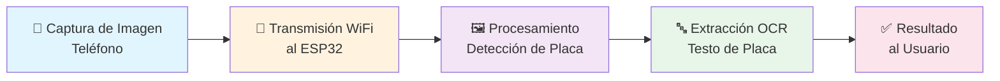

# Proyecto: Lector de Placas Vehiculares con ESP32

## 1. Objetivo General

Desarrollar un sistema embebido basado en ESP32 que capture imágenes de placas vehiculares a través de una cámara (preferentemente integrada en un teléfono móvil) y extraiga el texto de la placa utilizando técnicas de procesamiento de imágenes y reconocimiento óptico de caracteres (OCR).

## 2. Especificaciones Técnicas

### Hardware
- **Microcontrolador**: ESP32
- **Cámara**: Teléfono móvil (vía WiFi)
- **Conexión**: WiFi para comunicación con dispositivo móvil
- **Protoboard y componentes**: Cables de conexión, resistencias básicas, LED indicador

### Software
- **Plataforma**: Arduino IDE o VS Code con extensiones
- **Lenguaje**: C/C++ (Arduino)
- **Librerías**: 
  - WiFi (integrada en ESP32)
  - OpenCV o TensorFlow Lite para procesamiento
  - Tesseract OCR para extracción de caracteres

### Flujo de Datos

---

## 3. Viabilidad del ESP32

El ESP32 presenta características favorables para este proyecto:
- Conectividad WiFi integrada que permite comunicación con dispositivos móviles sin hardware adicional
- Memoria disponible suficiente para almacenar modelos de detección y librerías de procesamiento
- Compatibilidad con frameworks existentes como TensorFlow Lite, optimizados específicamente para microcontroladores
- Opción de arquitectura cliente-servidor donde el dispositivo solo envía imagen y recibe resultado procesado
- Accesibilidad en costo y disponibilidad comercial

---

## 4. Enfoque de Implementación

El procesamiento se realizará mediante librerías de código abierto:

- **Detección de placa**: OpenCV (visión por computadora)
- **Extracción de texto**: Tesseract OCR
- **Optimización**: TensorFlow Lite para modelos en microcontroladores

Arquitectura propuesta:
1. Captura desde dispositivo móvil
2. Envío a ESP32 mediante WiFi
3. Procesamiento en ESP32: detección de placa → extracción de región → OCR
4. Devolución de resultado al usuario

Todas las herramientas son de acceso abierto y sin costo de licencia.

---

## 5. Consideraciones sobre Base de Datos

Según el alcance del proyecto:
- Si se requiere historial de lecturas o registro de placas: necesitará almacenamiento persistente (SQLite local, Firebase o servidor propio)
- Si es solo demostración de OCR en tiempo real: no es obligatoria
- Firebase Realtime Database es gratuita en nivel básico
- SQLite se puede integrar en el servidor con Python/Node.js sin costos adicionales

---

## 6. Componentes Requeridos

ESP32, Protoboard, cables de conexión (30-40 piezas), LED indicador, resistencias (220Ω, 10kΩ), cable USB para programación
